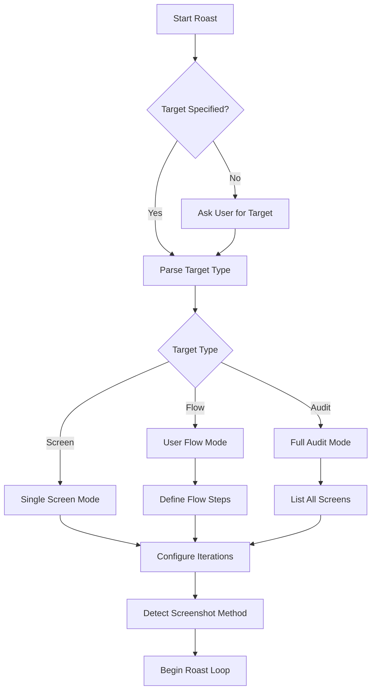

# 🔥 UI/UX Roast Skill

A comprehensive skill for brutally honest UI/UX critique with multi-perspective analysis and iterative improvement.

## Core Concept

The Roast skill orchestrates multiple specialist agents to analyze UI/UX from different professional perspectives, then synthesizes their findings into actionable, brutally honest feedback.

## Execution Workflow

### Phase 1: Configuration



### Phase 2: Screenshot Acquisition

**Platform Detection Order:**

1. **Xcode MCP** (iOS/macOS apps):
   ```
   Tool: mcp__xcodebuildmcp__screenshot
   Requirements: Simulator running or device connected
   Output: PNG to specified path
   ```

2. **Playwright MCP** (Web apps):
   ```
   Tool: playwright_screenshot (or equivalent)
   Requirements: Browser context active
   Output: PNG to specified path
   ```

3. **User Upload** (Fallback):
   ```
   Prompt: "Please upload a screenshot of [target]"
   Accept: File path or direct image upload
   Tool: Read (to view image)
   ```

### Phase 3: Multi-Perspective Analysis

**Parallel Agent Execution:**

| Agent | Model | Focus Area | Priority |
|-------|-------|------------|----------|
| `roaster-designer` | Sonnet | Visual design, hierarchy, color, typography | High |
| `roaster-developer` | Sonnet | Implementation feasibility, component structure | Medium |
| `roaster-user` | Sonnet | Usability, friction, task completion | High |
| `roaster-a11y` | Sonnet | Accessibility, WCAG compliance | Critical |
| `roaster-marketing` | Sonnet | Conversion, trust, brand | Medium |

**Execution Pattern:**
```
Launch ALL agents in parallel using Task tool:

Task(subagent_type="claude-roaster:roaster-designer", prompt="[screenshot context]")
Task(subagent_type="claude-roaster:roaster-developer", prompt="[screenshot context]")
Task(subagent_type="claude-roaster:roaster-user", prompt="[screenshot context]")
Task(subagent_type="claude-roaster:roaster-a11y", prompt="[screenshot context]")
Task(subagent_type="claude-roaster:roaster-marketing", prompt="[screenshot context]")
```

### Phase 4: Report Synthesis

**Report Structure:**

```markdown
# Roast Report: [Topic] - Iteration [X]

**Date:** [ISO date]
**Platform:** [iOS/Web/Android]
**Screenshot:** 

## The Verdict 🔥

[Synthesized brutal summary combining all perspectives]

---

## Issues by Severity

### 🔴 Critical (Fix NOW)

| # | Issue | Source | Impact | Fix |
|---|-------|--------|--------|-----|
| 1 | [Issue] | [Designer/A11y/etc] | [Impact] | [Specific fix] |

### 🟠 Major (Fix Soon)

| # | Issue | Source | Impact | Fix |
|---|-------|--------|--------|-----|

### 🟡 Minor (Nice to Have)

| # | Issue | Source | Impact | Fix |
|---|-------|--------|--------|-----|

---

## Perspective Deep Dives

### 🎨 Designer Says
[Full designer analysis]

### 💻 Developer Says
[Full developer analysis]

### 👤 User Says
[Full user analysis]

### ♿ Accessibility Expert Says
[Full a11y analysis]

### 📈 Marketing Says
[Full marketing analysis]

---

## Recommended Fix Priority

1. [First priority fix - usually accessibility or critical usability]
2. [Second priority]
3. [Third priority]
...

## Quick Wins (< 5 min each)
- [Easy fix 1]
- [Easy fix 2]

---

## Next Steps

[ ] Fix critical issues
[ ] Re-capture screenshot
[ ] Proceed to iteration [X+1]
```

### Phase 5: Fix Decision

**User Choice Presentation:**

```
AskUserQuestion:
  question: "We found [X] issues. How should we proceed?"
  options:
    - label: "Auto-implement all fixes"
      description: "I'll make all code changes in priority order"
    - label: "Report only"
      description: "Just save the report, no code changes"
    - label: "Cherry-pick fixes"
      description: "Let me choose which issues to fix"
    - label: "Skip to next iteration"
      description: "Roast again without fixing (for comparison)"
```

### Phase 6: Implementation (if chosen)

**Fix Execution Order:**
1. Critical (🔴) issues first
2. Then Major (🟠) issues
3. Skip Minor (🟡) unless time permits

**Post-Fix Verification:**
1. Run linting/type checking
2. Build verification
3. Take new screenshot
4. Brief comparison note

### Phase 7: Iteration Loop

```
FOR iteration = 1 TO max_iterations:
    capture_screenshot()
    analysis = parallel_roast(all_agents)
    report = synthesize(analysis)
    save_report(f"roast_{topic}_{iteration}.md")

    IF iteration < max_iterations:
        choice = ask_user_fix_preference()
        IF choice == "auto-implement":
            implement_fixes(report.critical + report.major)
        ELIF choice == "cherry-pick":
            selected = ask_user_which_fixes()
            implement_fixes(selected)

    NEXT iteration
```

### Phase 8: Final Report

**Final Summary Structure:**

```markdown
# 🔥 Final Roast Summary: [Topic]

## The Journey

| Iteration | Issues Found | Issues Fixed | Screenshot |
|-----------|--------------|--------------|------------|
| 1 | [X] | [Y] | [link] |
| 2 | [X] | [Y] | [link] |
| ... | ... | ... | ... |

## Before / After

### Initial State


### Final State


## Improvement Metrics

- **Total Issues Found:** [X]
- **Issues Resolved:** [Y]
- **Resolution Rate:** [Z%]
- **Accessibility Compliance:** [Before → After]
- **Estimated Conversion Impact:** [Assessment]

## Outstanding Issues

[Any issues not addressed, with reasons]

## Overall Score

| Category | Before | After | Δ |
|----------|--------|-------|---|
| Visual Design | X/10 | Y/10 | +Z |
| Usability | X/10 | Y/10 | +Z |
| Accessibility | X/10 | Y/10 | +Z |
| Developer Experience | X/10 | Y/10 | +Z |
| Marketing Effectiveness | X/10 | Y/10 | +Z |
| **OVERALL** | **X/10** | **Y/10** | **+Z** |

## Key Learnings

[Insights that apply beyond this specific screen]

## Recommendations for Future

[Systemic improvements to prevent similar issues]
```

---

## Configuration Options

### Roast Targets

| Target Type | Description | Example |
|-------------|-------------|---------|
| `screen` | Single screen analysis | `login screen` |
| `component` | Specific UI component | `navigation bar` |
| `flow` | Multi-screen user flow | `checkout flow` |
| `audit` | Full app audit | `entire app` |

### Iteration Count

- **Default:** 3 iterations
- **Minimum:** 1 (single roast, no iteration)
- **Maximum:** 10 (extensive refinement)
- **Recommended:** 3-5 for meaningful improvement

### Focus Areas (Optional)

User can request focus on specific perspectives:
- `--focus=accessibility` - Prioritize a11y
- `--focus=conversion` - Prioritize marketing
- `--focus=usability` - Prioritize user experience
- `--focus=visual` - Prioritize design
- `--focus=implementation` - Prioritize dev concerns

---

## File Structure

```
project/
└── reports/
    └── roast/
        ├── screenshots/
        │   ├── login-screen_1.png
        │   ├── login-screen_2.png
        │   └── login-screen_final.png
        ├── roast_login-screen_1.md
        ├── roast_login-screen_2.md
        └── roast_login-screen_final.md
```

---

## Smart Delegation

| Task | Agent | Model | Notes |
|------|-------|-------|-------|
| Overall orchestration | `roaster` | Opus | Main coordinator |
| Visual analysis | `roaster-designer` | Sonnet | Color, typography, layout |
| Implementation review | `roaster-developer` | Sonnet | Code feasibility |
| Usability testing | `roaster-user` | Sonnet | Friction points |
| Accessibility audit | `roaster-a11y` | Sonnet | WCAG compliance |
| Conversion analysis | `roaster-marketing` | Sonnet | Trust, CTAs |
| Code fixes | Main agent or `sisyphus-junior` | - | Implementation |

---

## Quality Checklist

Before completing a roast session:

- [ ] All perspective agents were run
- [ ] Screenshot captured for each iteration
- [ ] Report generated with linked screenshots
- [ ] Issues categorized by severity
- [ ] Specific fixes provided (not vague suggestions)
- [ ] User confirmed fix preferences
- [ ] Final summary includes before/after comparison
- [ ] Outstanding issues documented

---

## Example Session

```
User: /roast login screen

Roaster: 🔥 ROAST SESSION INITIALIZED!

Target: Login Screen
Platform detected: iOS (Xcode MCP available)
Iterations: 3 (default)

[Takes screenshot using mcp__xcodebuildmcp__screenshot]

Launching the roast squad in parallel...
- 🎨 Designer analyzing visual hierarchy...
- 💻 Developer checking component structure...
- 👤 User researcher testing usability...
- ♿ A11y expert auditing accessibility...
- 📈 Marketing reviewing conversion elements...

[Agents complete]

## ITERATION 1 ROAST 🔥

[Brutal synthesis of all perspectives]

Report saved: reports/roast/roast_login-screen_1.md

We found 12 issues (3 critical, 5 major, 4 minor).

How do you want to proceed?
- 🔧 Auto-implement fixes
- 📋 Report only
- 🎯 Cherry-pick fixes
- ⏭️ Next iteration

[User selects auto-implement]

Implementing fixes in priority order...
[Makes changes]
[Takes new screenshot]

Proceeding to iteration 2...

[... continues for configured iterations ...]

## FINAL ROAST SUMMARY 📊

[Complete before/after analysis]
[Overall improvement score]
[Remaining recommendations]

Session complete! Your UI went from "needs work" to "shipping material" 🚀
```
